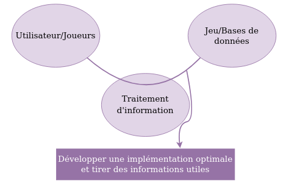
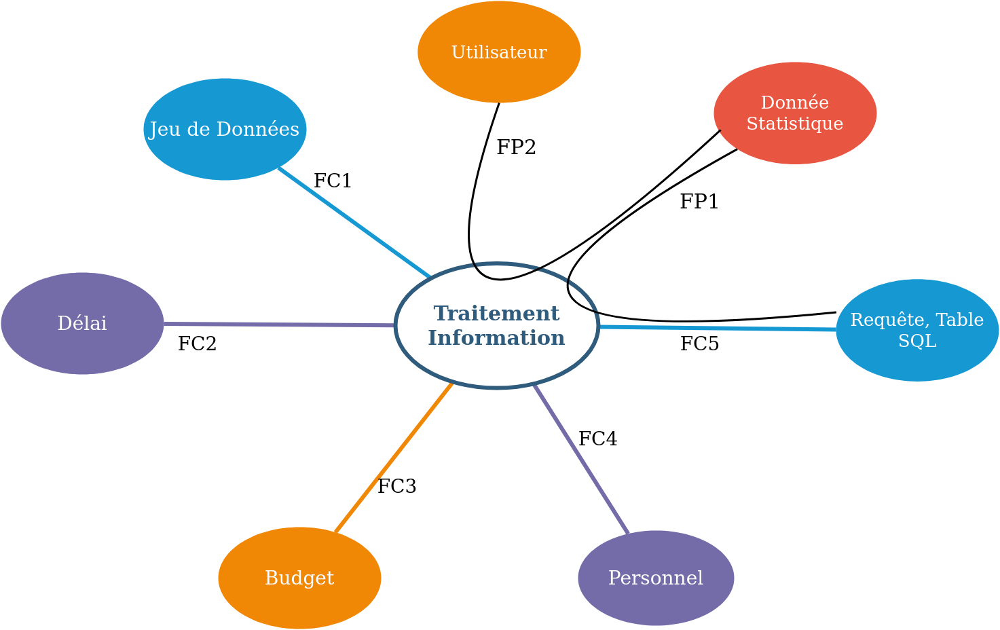

# PRÉSENTATION

## 1.1) Description

Dans le cadre de cette SAE, nous avons choisie de reprendre la gestion de projet que l'on doit réalisé lors de la SAE 2.04. En effet, nous devons choisir une base de donnée sur le thème de notre choix, et nous devons, avec ce jeu de donnée, nous poser les bonnes questions pour faire des requêtes SQL pertinente et ressortir des statistiques qui pourront servir pour un individu quelconque. Ainsi nous allons définir la structure du projet et établir le nécessaire pour son bon déroulement.

## 1.2) Genèse de l'idée

Notre idée de projet est de récupérer une base de donnée sur le jeux "League Of Legend" afin de développer une implémentation optimal et d'en tiré des informations utiles. Nous traitons dans ce jeu de donnée les personnages du jeu, mais aussi les items que chaque joueurs peuvent acheter. Il faut savoir qu'un joueur peu acheter au maximum 6 items. Dans le cadre de ce projet, il faut savoir tirer profit des bonus d'items et de proposer les meilleurs compositions d'items pour chaque personnages, pour que les joueurs, puisse tirer un maximum de profit leurs de leurs parties (que se soit en terme de hp, dégats ou défense).

## 1.3) Maître d'oeuvre, maitre d'ouvrage, équipe de projet

Le maitre d'oeuvre sera l'ensemble de l'équipe enseignant en base de données, qui nous ont fourni le projet à réaliser.
La maitrise d'ouvrage sera donc l'ensemble des particuliers, notamment des joueurs. Enfin, l'équipe de projet se compose de VERDIER Nathan, KARTAL Emre et MUZARD Thomas. 

## 1.4) Transcription des besoins

**Bête à cornes**:
   

 

**Outils pieuvre**:

 

## 1.5) Description des livrables

Lors du compte rendu final, nous aurons donc, un jeu de données, suivie de requete pertinente et des statistique sur l'ensemble des objets, et personnages. L'objectif et d'optimisé au maximum chaque personnage du jeu avec des items qui lui sont propre. Nous avons pour cela, créé une base de donnée nécessaire au traitement. L'analyse des graphiques ainsi que le MCD et MLD.

## 1.6) Niveau de confidentialité

Le jeu de donnée que nous avons choisie est une base de donnée publique, ainsi, aucune donnée doit être impérativement garder privée. De ce fait, nous pouvons dire que le niveau de confidentialité du projet est quasiment null.

