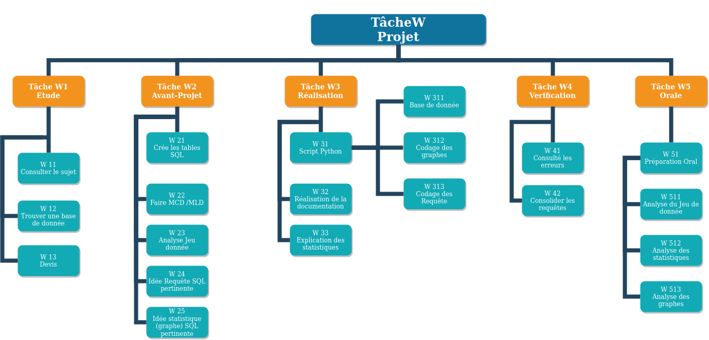

# WBS

 

## Description

Notre WBS se voit partager en 4 partie :
- En première partie nous avons l'Etude du projet, correspondant aux prérequis, constituer en deux sous-partie "Informatique" et "Financier", elle regroupe les bases (Connaissances et matériel) requis pour la bonne réalisation des tâches.
- En second nous avont l'Avant-Projet, qui nous indique les étapes à suivre pour pouvoir réaliser le projet.
- Puis, les Outils et lieu de travail qui peuvent nous être utile et déterminer les moyen mis a disposition pour la réalisation du projet.
- Et en dernier, le Projet, qui regroupe la liste des rendues que l'on va devoir fournir.